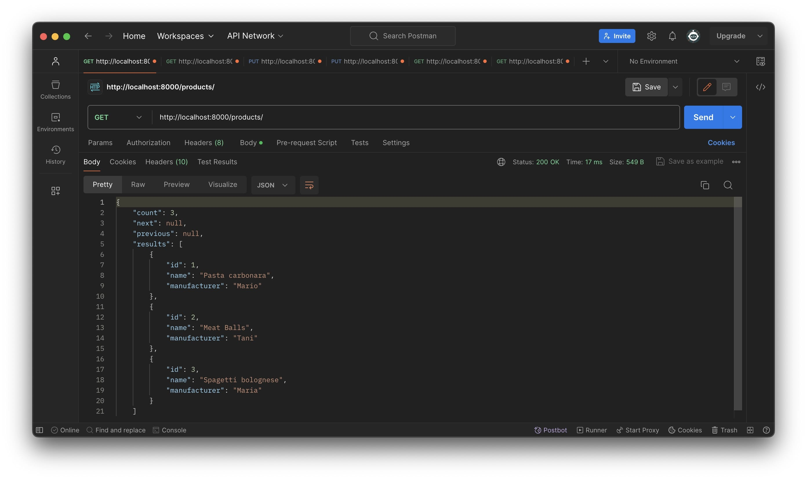
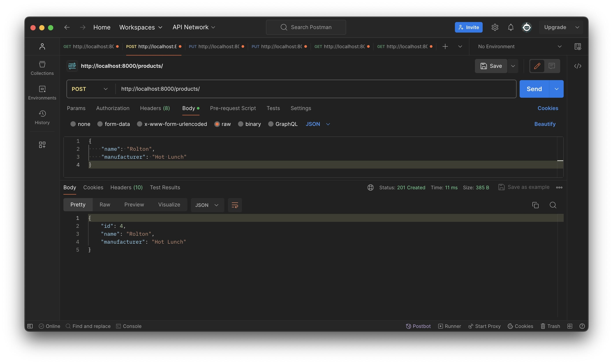
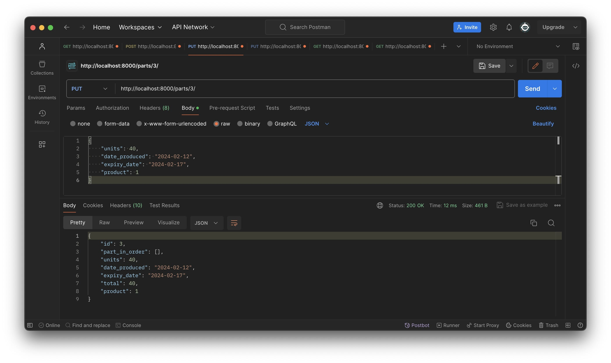
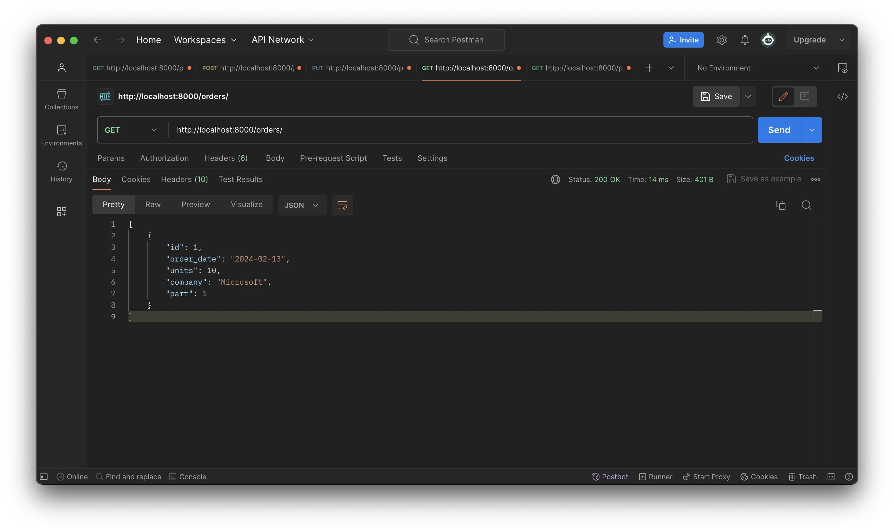
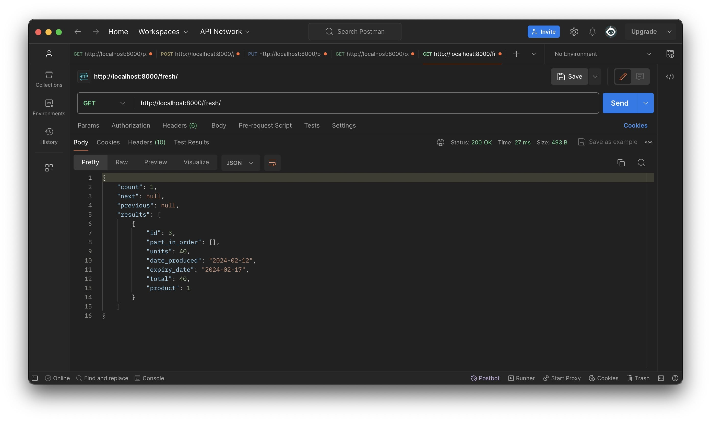

# Invetor Manegement System


> Этот API для управления запасами в складах, вы можете отслеживать информации о продукции, частях и заказах.







**Пример программы так работает.**

## `Endpoints:`
- `GET` → `…/products`  all products
- `GET` → `…/products/<int:pk>`  single product
- `POST` → `…/products` add a single product
- `PUT` → `…/products/<int:pk>`  update a single product
- `DELETE` → `…/products/<int:pk>`  delete a single product

- `GET` → `…/part`  all part
- `GET` → `…/parts/<int:pk>`  single part
- `POST` → `…/parts` add a single part
- `PUT` → `…/parts/<int:id>`  update a single part
- `DELETE` → `…/parts/<int:id>`  delete a single part

- `GET` → `…/orders`  all orders
- `POST` → `…/oders`  add single order

- `GET` → `…/expired`  all expired parts
- `GET` → `…/expiring`  all expiring parts
- `GET` → `…/fresh`  all fresh parts


## Установка pipenv

1. Убедитесь, что Python установлен на вашем компьютере.
2. Установите pipenv с помощью команды:
    ```
    $ pip install pipenv
    ```
3. Установите зависимости, запустив `pip install -r requirements.txt`

### Клонирование проекта и установка зависимостей

1. Клонируйте репозиторий:
    ```
    $ git clone https://github.com/Humoyun004/InventoryManegement_Api.git
    ```
2. Заходите в репозиторий:
    ```
    cd InventoryManegement_Api
    ```

3. Запустите команду `pipenv install`, чтобы создать виртуальное окружение и установить все зависимости из файла `Pipfile.lock`.

### Работа с проектом

- Для активации виртуального окружения запустите:
    ```
    pipenv shell
    ```
- Для установки новых зависимостей выполните:
    ```
    pipenv install <название_пакета>
    ```
- Чтобы запустить скрипты или приложение из вашего проекта, используйте `pipenv run`.


## Вклад
**Если вы хотите внести свой вклад в развитие приложения  пожалуйста, следуйте этим шагам:**

1. Форкните репозиторий на GitHub.
2. Клонируйте ваш форк репозитория на локальную машину.
3. Создайте новую ветку для вашей функции или исправления ошибки.
4. Внесите изменения и сделайте коммиты с описательными сообщениями.
5. Отправьте ваши изменения в ваш форк репозитория.
6. Создайте pull request (запрос на включение) в основной репозиторий.

## Контакты
**Если у вас есть вопросы или предложения относительно приложения, пожалуйста, свяжитесь с нами по адресу `humoyunakbaraliev1@gmail.com`. Мы ценим ваше мнение!**


